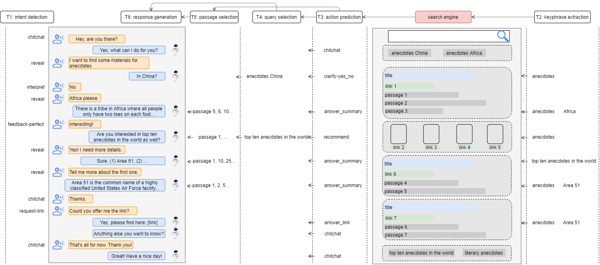
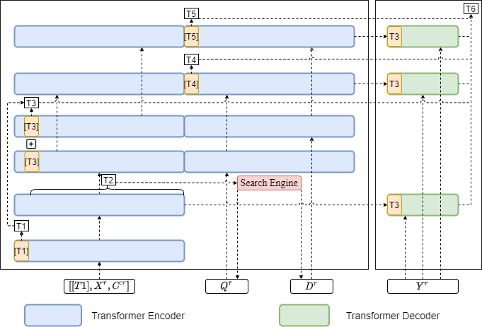

# Wizard of Search Engine: Access to Information Through Conversations with Search Engines

by *Pengjie Ren, Zhongkun Liu, Xiaomeng Song, Hongtao Tian, Zhumin Chen, Zhaochun Ren and Maarten de Rijke*

>>@inproceedings{ren2021wizard,\
>>title={Wizard of Search Engine: Access to Information Through Conversations with Search Engines},\
>>author={Ren, Pengjie and Liu, Zhongkun and Song, Xiaomeng and Tian, Hongtao and Chen, Zhumin and Ren, Zhaochun and de Rijke, Maarten},\
>>booktitle={Proceedings of the 44th International ACM SIGIR Conference on Research and Development in Information Retrieval},\
>>year={2021}\
>>}

## Paper summary

\
*Task pipeline for conversational information seeking (CIS)*\
\
*Model pipeline for conversational information seeking (CIS)*

In this work, we make efforts to facilitate research on conversational information seeking (CIS) from three angles: (1) We formulate a pipeline for CIS with six sub-tasks: intent detection, keyphrase extraction, action prediction, query selection, passage selection, and response generation. (2) We release a benchmark dataset, called wizard of search engine(WISE), which allows for comprehensive and in-depth research on all aspects of CIS. (3) We design a neural architecture capable of training and evaluating both jointly and separately on the six sub-tasks, and devise a pre-train/fine-tune learning scheme, that can reduce the requirements of WISE in scale by making full use of available data. 

## Running experiments

### Requirements

This code is written in PyTorch. Any version later than 1.6 is expected to work with the provided code. Please refer to the [official website](https://pytorch.org/) for an installation guide.

We recommend to use conda for installing the requirements. If you haven't installed conda yet, you can find instructions [here](https://www.anaconda.com/products/individual). The steps for installing the requirements are:

+ Create a new environment

   ```
   conda create env -n WISE
   ```

   In the environment, a python version >3.6 should be used.

+ Activate the environment

   ```
   conda activate WISE
   ```

+ Install the requirements within the environment via pip:

   ```
   pip install -r requirements.txt
   ```

### Datasets

We use [WebQA](http://spaces.ac.cn/archives/4338/), [DuReader](http://ai.baidu.com/broad/download?dataset=dureader), [KdConv](https://github.com/thu-coai/KdConv/tree/master/data) and [DuConv](https://ai.baidu.com/broad/introduction?dataset=duconv) datasets for pretraining. You can get them from the provided links and put them in the corresponding folders in `./data/`. For example, WebQA datasets should be put in `./data/WebQA`, and DuReader datasets in `./data/Dureader` and so on.  We use the WISE dataset to fine-tune the model, and this dataset is available in `./data/WISE`. Details about the WISE dataset can be found in [data](./WISE.md).

### Training

+ Run the following scripts to automatically process the pretraining datasets into the required format:

```
python ./Run.py --mode='data'
```

+ Run the following scripts sequentially:

```
python -m torch.distributed.launch --nproc_per_node=4 ./Run.py --mode='pretrain'
python -m torch.distributed.launch --nproc_per_node=4 ./Run.py --mode='finetune'
```

Note that you should select the appropriate pretrain models from the folder `./output/pretrained`, and put them into `./output/pretrained_ready` which is newly created by yourself before finetuning. The hyperparameters are set to the default values used in our experiments. To see an overview of all hyperparameters, please refer to `./Run.py`.

### Evaluating

+ Run the following scripts:

```
python -m torch.distributed.launch --nproc_per_node=4 ./Run.py --mode='infer-valid'
python -m torch.distributed.launch --nproc_per_node=4 ./Run.py --mode='eval-valid'
```

```
python -m torch.distributed.launch --nproc_per_node=4 ./Run.py --mode='infer-test'
python -m torch.distributed.launch --nproc_per_node=4 ./Run.py --mode='eval-test'
```
